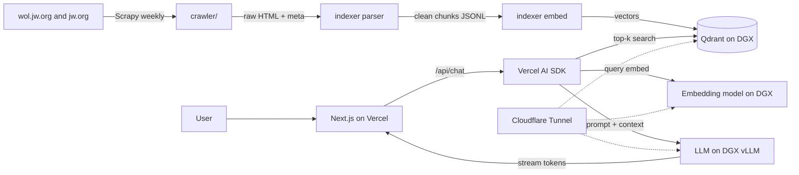

# Architecture

## Data flow

## Why these choices

- Vercel AI SDK + OpenAI-compatible provider lets the same code point at a
  local vLLM server by setting baseURL. No vendor lock-in.
- Qdrant runs locally on DGX Spark, scales to millions of vectors, and has
  rich payload filtering (publication, year, language).
- Cloudflare Tunnel exposes the DGX services to Vercel without opening any
  ports on the home network. Free, secure, zero-config TLS.
- GitHub Actions for the weekly crawl avoids needing a server-side
  scheduler; the runner pushes new data into Qdrant via the tunnel.

## Security

- All DGX endpoints sit behind a small reverse proxy that requires a bearer
  API key.
- Talisman pre-commit hook + gitleaks in CI prevent leaking that key.
- /api/chat has IP-based rate-limiting (Vercel KV).
