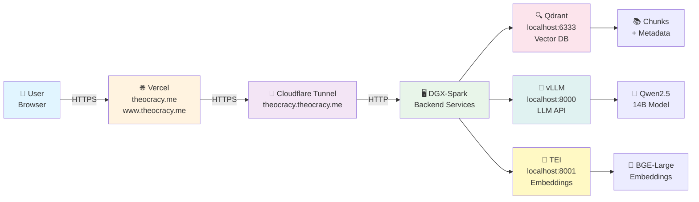

# Production Architecture Guide

## System Architecture Diagram



## Data Flow

### Query Processing
1. **User Input** → Sent via HTTPS to `theocracy.me` (Vercel)
2. **Frontend** → Calls `/api/chat` endpoint
3. **Cloudflare Tunnel** → Routes request through encrypted tunnel to DGX
4. **Embedding** → Query converted to 1024-dim vector (TEI)
5. **Vector Search** → Qdrant searches for similar chunks (MMR re-ranking)
6. **LLM Generation** → vLLM generates response using Qwen2.5-14B
7. **Streaming** → Response streamed back to browser in real-time

### Data Architecture
```
┌─────────────────────────────────────────────────────────────────┐
│ JW-Only Content Pipeline                                        │
├─────────────────────────────────────────────────────────────────┤
│                                                                 │
│  jw.org & wol.jw.org                                           │
│         │                                                       │
│         ▼                                                       │
│   [Scrapy Crawler] (Weekly schedule)                           │
│         │                                                       │
│         ▼                                                       │
│   Raw HTML (data/raw/)                                         │
│         │                                                       │
│         ▼                                                       │
│   [Parser] → Markdown with metadata                            │
│         │                                                       │
│         ▼                                                       │
│   [Chunker] → Fragments with titles, publications, dates       │
│         │                                                       │
│         ▼                                                       │
│   [Embedder] → 1024-dim vectors (BGE-Large-en-v1.5)            │
│         │                                                       │
│         ▼                                                       │
│   [Qdrant] ◄─────────────┐                                     │
│         │                │                                     │
│         ▼                │                                     │
│   Vector DB              │                                     │
│   (~1M chunks)           │                                     │
│                          │                                     │
│   Query Processing       │                                     │
│   ─────────────────      │                                     │
│   User Question  ─────────────────► [Embedder] ──┐            │
│         │                                        │            │
│         └────────────────────────────────────────┘            │
│                   │                                            │
│                   ▼                                            │
│           [MMR Re-ranking]                                     │
│                   │                                            │
│                   ▼                                            │
│           [vLLM] ← Context + history                          │
│                   │                                            │
│                   ▼                                            │
│           LLM Response (streaming)                             │
│                   │                                            │
│                   ▼                                            │
│           Browser UI (theocracy.me)                            │
│                                                                 │
└─────────────────────────────────────────────────────────────────┘
```

## Network Topology

### Production (Cloudflare Tunnel)
```
┌──────────────────────────────────────────────────────────────────┐
│ Internet (Public)                                                │
├──────────────────────────────────────────────────────────────────┤
│                                                                  │
│  User (HTTPS)                      DNS Resolver                │
│     │                                    │                      │
│     │  theocracy.me                      │                      │
│     │  www.theocracy.me                  │                      │
│     ▼                                    ▼                       │
│  ┌─────────────────┐        ┌──────────────────────┐           │
│  │  Vercel         │        │  Cloudflare DNS      │           │
│  │  CDN + FaaS     │        │  theocracy.me        │           │
│  │                 │        │  www → Vercel        │           │
│  │  Hosted on      │        │  *.theocracy.me      │           │
│  │  AWS Lambda     │        │  → Tunnel            │           │
│  └─────────────────┘        └──────────────────────┘           │
│         │                                                       │
│         │  HTTPS (TLS 1.3)                                     │
│         │                                                       │
│         └────────────────────────────────────┐                │
│                                              │                │
└──────────────────────────────────────────────┼────────────────┘
                                               │
                    ┌──────────────────────────▼─────────────────┐
                    │ Cloudflare Tunnel                          │
                    │ (Zero Trust Network Access)                │
                    └──────────────────────────┬─────────────────┘
                                               │
                         ┌─────────────────────┴─────────────────┐
                         │  HTTP (Internal, Encrypted)           │
                         │                                       │
┌────────────────────────▼──────────────────────────────────────┐
│ DGX Spark (Corporate Network)                                │
│ Private IP: 10.x.x.x (not exposed to internet)              │
├────────────────────────────────────────────────────────────────┤
│                                                               │
│  ┌─────────────────────────────────────────┐                 │
│  │ Docker Network (jw-research_default)    │                 │
│  │                                         │                 │
│  │  ┌──────────────────┐                   │                 │
│  │  │ jw_cloudflared   │                   │                 │
│  │  │ (Tunnel Agent)   │ ◄──────┐          │                 │
│  │  └──────────────────┘        │          │                 │
│  │         │                    │          │                 │
│  │    HTTP │ (localhost)        │ Tunnel   │                 │
│  │         ▼                    │          │                 │
│  │  ┌──────────────────┐        │          │                 │
│  │  │ jw_qdrant        │        │ Routes   │                 │
│  │  │ :6333            │────────┼─────────►│                 │
│  │  └──────────────────┘        │          │                 │
│  │                              │          │                 │
│  │  ┌──────────────────┐        │          │                 │
│  │  │ jw_vllm          │        │          │                 │
│  │  │ :8000            │────────┼─────────►│                 │
│  │  └──────────────────┘        │          │                 │
│  │                              │          │                 │
│  │  ┌──────────────────┐        │          │                 │
│  │  │ jw_embed         │        │          │                 │
│  │  │ :8001            │────────┼─────────►│                 │
│  │  └──────────────────┘        │          │                 │
│  │                              │          │                 │
│  │  ┌──────────────────┐        │          │                 │
│  │  │ jw_crawler       │        │          │                 │
│  │  │ (scheduler)      │        │          │                 │
│  │  └──────────────────┘        │          │                 │
│  │                              │          │                 │
│  │  ┌──────────────────┐        │          │                 │
│  │  │ jw_indexer       │        │          │                 │
│  │  │ (pipeline)       │        │          │                 │
│  │  └──────────────────┘        │          │                 │
│  │                              │          │                 │
│  └──────────────────────────────┼──────────┘                 │
│                                 │                             │
│         Shared Volumes:          │                             │
│         • qdrant_data            │                             │
│         • hf_cache               │                             │
│         • tei_cache              │                             │
│         • crawler_data           │                             │
│         • indexer_state          │                             │
│                                                               │
│  GPU Devices:                                                 │
│  • H100 x8 (allocated to vllm, embed, crawler)               │
│                                                               │
└───────────────────────────────────────────────────────────────┘
```

## Security Model

### Authentication & Authorization
- **User → Vercel**: HTTPS TLS 1.3, public endpoint
- **Vercel → Cloudflare**: HTTPS encrypted tunnel
- **Cloudflare → DGX**: HTTP over Cloudflare Tunnel (encrypted tunnel layer)
- **DGX Internal**: Docker network isolation

### API Keys & Secrets
- `NVIDIA_API_KEY`: Used by Vercel and DGX (for LLM/embeddings calls)
- `DGX_API_KEY`: Bearer token for vLLM and embeddings endpoints
- `QDRANT_API_KEY`: Optional, for Qdrant authentication
- `CLOUDFLARE_TUNNEL_TOKEN`: Authenticates DGX to Cloudflare network
- `HF_TOKEN`: Used by vLLM/TEI for model downloads

### Data Isolation
- Qdrant: Contains only parsed/chunked JW content (no external data)
- HTTP Cache: Stores raw HTML, respects robots.txt
- State: Tracks indexing progress, chunk hashes

### Network Isolation
- DGX services NOT exposed to internet (only via Tunnel)
- Cloudflare Tunnel provides:
  - Encryption (mTLS)
  - DDoS protection
  - WAF rules
  - Rate limiting

## Performance Characteristics

### Latency
- **Cold Start** (first query): 3-5 seconds (LLM model load)
- **Warm Query** (subsequent): 1-2 seconds (vector search + generation)
- **Embedding** (~256 tokens): 200-500ms
- **Vector Search** (top-k=8): 50-100ms
- **LLM Generation** (300 tokens): 800-1200ms

### Throughput
- **Concurrent Users**: Limited by GPU memory (typically 4-8 concurrent)
- **Requests/sec**: ~2 req/s with queue
- **Tokens/sec**: ~40 tokens/sec (vLLM, Qwen2.5-14B)

### Storage
- **Qdrant Volume**: ~50-100GB (1M chunks × ~50-100KB each)
- **HF Cache**: ~100GB (model weights for vLLM + TEI)
- **TEI Cache**: ~50GB (embeddings cache)
- **Raw HTML**: ~500GB (growing weekly)

## Deployment Environments

### Local Development
- Runs on developer machine
- Docker Compose (Qdrant, vLLM, TEI)
- Next.js dev server on port 3000
- No Cloudflare Tunnel needed

### Staging
- DGX Spark (same hardware as production)
- Separate tunnel: `jw-research-staging`
- DNS: `staging.theocracy.me`
- For testing before production

### Production
- DGX Spark main cluster
- Tunnel: `jw-research`
- DNS: `theocracy.me`, `www.theocracy.me`
- Frontend: Vercel production deployment

## Scaling & Future Upgrades

### Vertical Scaling
- Increase `gpu-memory-utilization` in vLLM (currently 0.85)
- Add more GPUs to DGX (currently H100×8)
- Increase Qdrant's `max_payload_size`

### Horizontal Scaling
- Multiple DGX nodes with distributed Qdrant
- Load balancer in front of Cloudflare Tunnel
- Multi-region Vercel edge deployments

### Model Upgrades
- Switch to larger LLM (Qwen2.5-32B, Llama3-70B)
- Update embeddings model (bge-large-en-v1.5.2, e5-large)
- Implement quantization for faster inference

## Related Documentation

- [DEPLOYMENT.md](DEPLOYMENT.md) — Step-by-step deployment guide
- [DEPLOYMENT_CHECKLIST.md](DEPLOYMENT_CHECKLIST.md) — Verification checklist
- [CLOUDFLARE_SETUP.md](CLOUDFLARE_SETUP.md) — Cloudflare Tunnel configuration
- [ENVIRONMENT.md](ENVIRONMENT.md) — Environment variable reference
- [ARCHITECTURE.md](ARCHITECTURE.md) — Original architecture decisions
